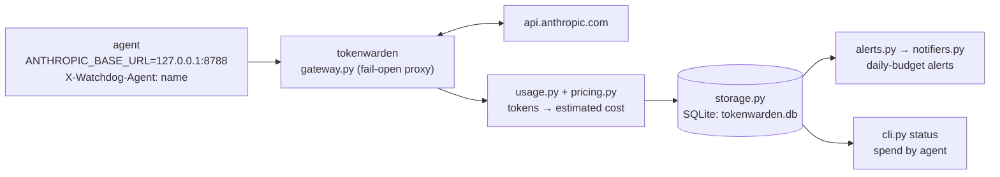

# tokenwarden

A lightweight local gateway that meters **Claude API spend per agent**, logs
every billing event to SQLite, and alerts when daily spend approaches a budget
you set.

Point your agents at it with one environment variable. No SDK changes, no admin
key, works with any language.

> Why this exists: Anthropic's billing for programmatic / Agent-SDK usage is in
> flux (a planned 2026-06-15 split was paused on launch day — the third reversal
> in the area since January). tokenwarden defends against surprise charges, and
> it treats the price table as **config** so it doesn't break the next time rates
> change. See [SPEC.md](SPEC.md) for the full design.

## How it works



- **Transparent reverse proxy.** Forwards every request to Anthropic untouched
  and streams the response straight back. It is **fail-open**: if metering ever
  errors, your agent still gets its response.
- **Per-agent attribution.** Each agent identifies itself with an
  `X-Watchdog-Agent: <name>` header. That label is whatever you choose.
- **Estimated cost** from a configurable price table (defaults ship for current
  models). Stored dollars are estimates until Cost-API reconciliation (phase 2).
- **No secrets stored.** Your API key is only forwarded, never persisted. Prompt
  bodies are not logged.

## Quickstart

```bash
pip install -e ".[dev]"
cp config.example.toml config.toml      # edit budgets/timezone as needed
tokenwarden serve                        # starts the gateway on 127.0.0.1:8788

# point an agent at it
export ANTHROPIC_BASE_URL=http://127.0.0.1:8788
# and have it send a header identifying itself, e.g. X-Watchdog-Agent: forge

tokenwarden status                       # today's estimated spend by agent

# or dogfood the whole Part-A path (boot -> one cheap call -> status -> teardown):
ANTHROPIC_API_KEY=sk-ant-api03-... scripts/smoke.sh
```

## Run as a service (macOS)

Reproducible install, then run under launchd:

```bash
pip install -r requirements.txt && pip install -e .     # pinned, tested versions
```

A LaunchAgent template lives in [`packaging/`](packaging/com.tokenwarden.gateway.plist) — replace `REPO` with the absolute repo path and load it:

```bash
sed "s#REPO#$PWD#g" packaging/com.tokenwarden.gateway.plist > ~/Library/LaunchAgents/com.tokenwarden.gateway.plist
launchctl load ~/Library/LaunchAgents/com.tokenwarden.gateway.plist
```

## Enforcement (optional)

By default tokenwarden only observes and alerts. Set `enforce = true` in `[gateway]`
to also **refuse** requests with HTTP 429 once an agent (or the global pool) is at or
over its daily budget — *before* the call reaches Anthropic, so the over-budget spend
never happens. The request that crosses the line still goes through (its cost isn't
known until the response); the next one is blocked.

> It returns **429** with no `Retry-After` (Anthropic SDKs back off briefly, then
> surface the error). If you'd rather agents fail fast without retrying, **403** is a
> one-line change.

## Forecasting (optional, forward-looking)

Budget alerts are backward-looking — they fire *after* you've crossed a threshold.
`tokenwarden forecast` adds a forward-looking view: it reads the spend history you've
already logged and projects **today's end-of-day total**, so it can warn *before* an
overrun lands and flag a runaway agent whose spend punches above its normal band.

```bash
tokenwarden forecast                 # project every agent + global for the rest of today
tokenwarden forecast --agent forge   # just one agent
tokenwarden forecast --notify        # also send alerts via your configured channels
```

```text
End-of-day spend forecast for 2026-07-06 (UTC), backend=naive:
  forge          projected $11.6000 (band $10.16–$14.53) / $8.00 budget
    ! [CRITICAL] Agent 'forge' daily spend projected to reach $14.53 of $8.00 budget (182%) ...
  scout          projected $11.1200 (band $10.70–$18.70) / $8.00 budget
    ! [CRITICAL] Agent 'scout' anomalous spend $9.10 exceeds the forecast band of $0.09 ...
```

Two backends, selected in `[forecasting]`:

- **`naive`** (default) — a stdlib seasonal baseline. No extra dependencies.
- **`timesfm`** — zero-shot [TimesFM 2.5](https://github.com/google-research/timesfm),
  Google's time-series foundation model. Needs the optional extra:
  ```bash
  pip install "tokenwarden[forecast]"   # pulls in torch — heavy, opt-in only
  ```

Forecasting runs as a **separate process that reads the DB read-only** — the heavy
model is never imported into the `serve` gateway, so the fail-open request path stays
untouched (enforced by a test). Compare the two backends on your own data with
`python scripts/forecast_benchmark.py --config config.toml`.

> Early on, a young DB has too little history for a confident forecast; those lines are
> marked `[low confidence: sparse history]`. It sharpens as the gateway accumulates days.

## Status

- **M0 — config** ✅ TOML schema, validation, configurable price table.
- **M1 — gateway** ✅ passthrough (JSON + streaming SSE), fail-open, usage
  extraction → SQLite, cost estimation, `serve` / `status` CLI.
- **M2** cost-engine polish + richer `status`/`report`.
- **M3 — alerts** ✅ daily budget evaluation, warn/critical with per-day hysteresis, Discord + Telegram notifiers.
- **M4 — packaging** ✅ pinned deps + `requirements.txt`, LaunchAgent template, GitHub Actions CI, Makefile.
- **Forecasting** ✅ `forecast` CLI: end-of-day projection + anomaly detection, naive
  baseline + optional zero-shot TimesFM, isolated from the serving path.
- **Phase 2** Admin Cost/Usage API reconciliation + drift detection.

## What it can't see (yet)

Managed Agents' internal model calls (the loop runs Anthropic-side) and
subscription-token agents (no per-token dollars). Both are covered by the
phase-2 Admin-API collector. See [SPEC.md](SPEC.md).

## License

MIT
